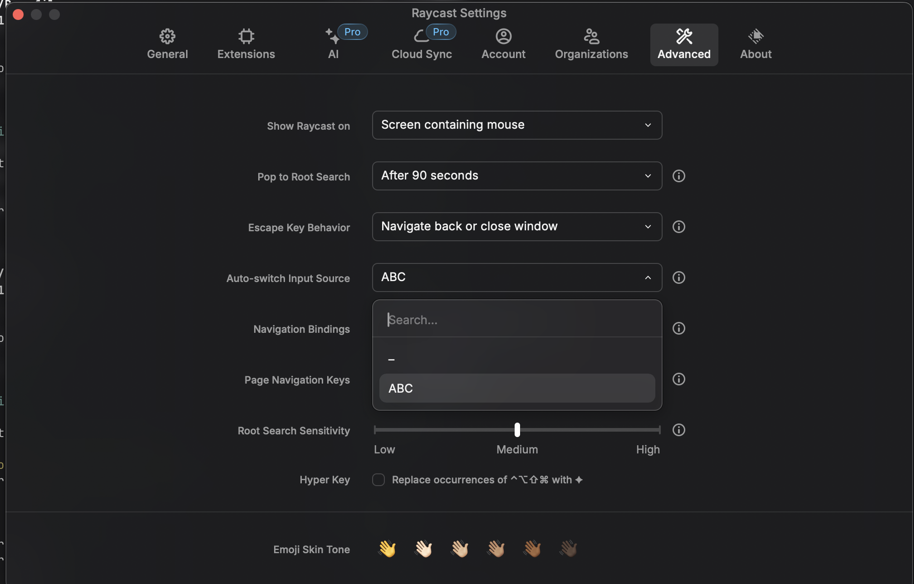
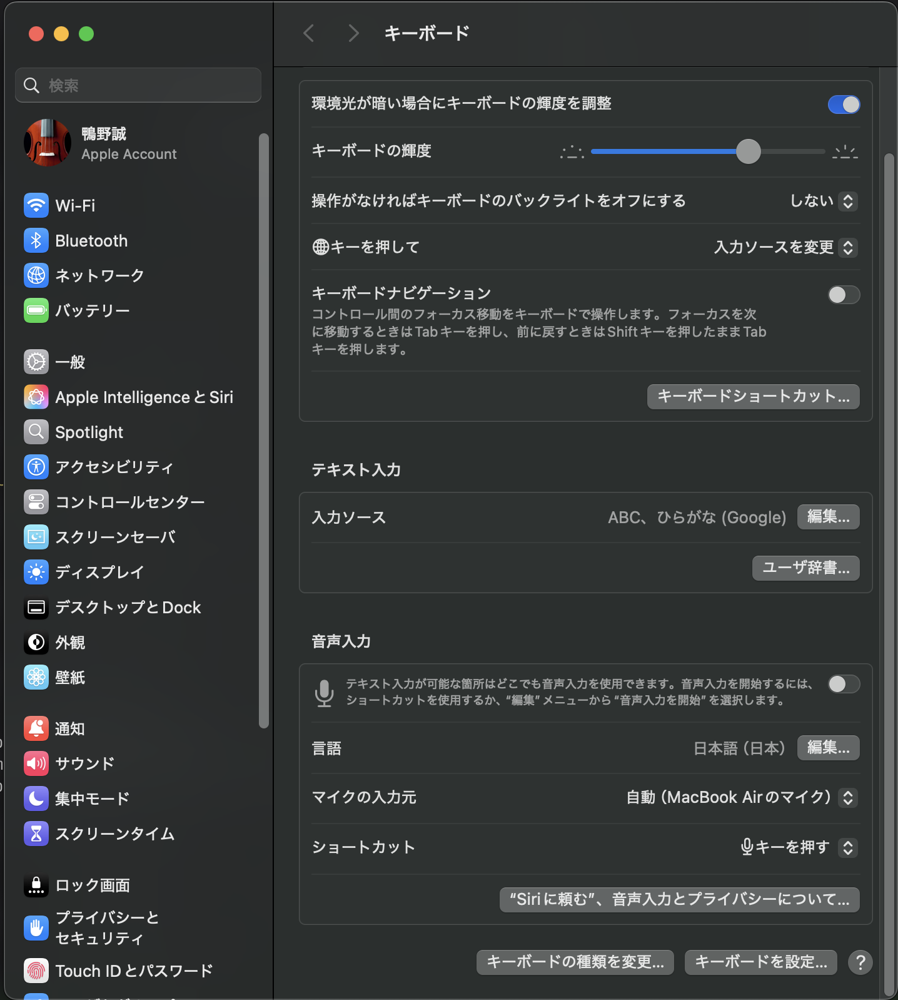
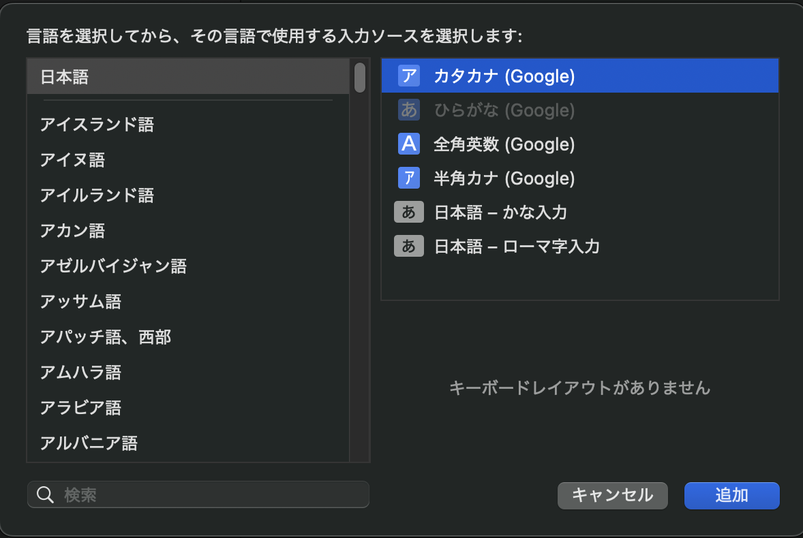
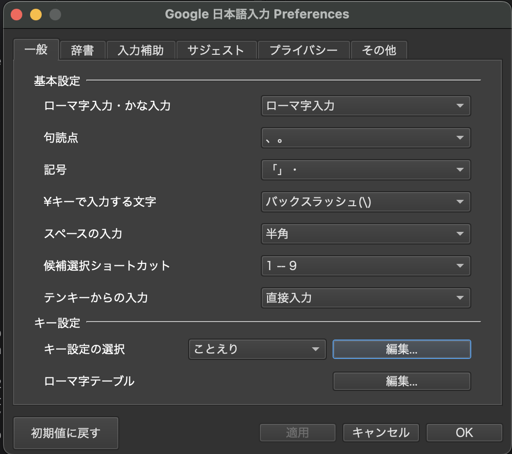
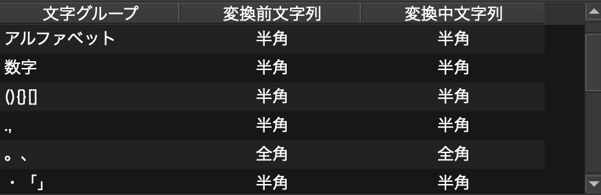
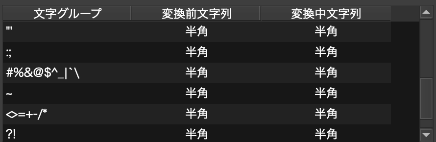

# Setup Mac OS

データのバックアップはこちらから

[backup.md](./docs/backup.md)

## Homebrew

```bash
/bin/bash -c "$(curl -fsSL https://raw.githubusercontent.com/Homebrew/install/HEAD/install.sh)"
```

その後のインストラクションに従ってPATHを通す

## Clone Repository

```bash
cd ~
git config --global user.name <username>
git config --global user.email <email>
git clone https://github.com/Mkamono/macos-setup.git
```

## Install Brew Packages

```bash
brew bundle --file=~/macos-setup/Brewfile
task -g brew:bundle
```

## Setup Zsh, etc... (via task)

```bash
cd ~/macos-setup
task init
```

## Brave

USBメモリに保存した同期コードを入力し、同期まで待つ
GitHubのパスキーを作っておくと便利

### ブラウザで認証する系
```bash
gh auth login
gcloud auth login
gcloud auth application-default login
```

## Setup Raycast

auto switch input sourceをABCに変更


インストールするプラグイン
- Brave
- Brew
- Copy Path or URL
- GitHub
- Google Cloud Platform Search
- Google Search
- Copy Path or URL
- Open Browser Profile
- Test Internet Speed
- Visual Studio Code

設定するショートカット
- Applications
  - Brave: `Option + B`
  - Discord: `Option + D`
  - Finder: `Option + E(Explorer)`
  - Ghostty: `Option + T(Terminal)`
  - Google カレンダー(PWA): `Option + C`
  - Notion: `Option + N`
  - Visual Studio Code: `Option + V`
  - システム設定: `Option + I`
- Brave
  - Search Brave Bookmarks: `Option + ,`
- Clipboard History
  - Clipboard History: `Shift + Option + V`
- Copy Path or URL: `Shift + Option + C`
- Google Search
  - Google Search: `Option + G`
- Window Management
  - Bottom Half: `Option + Down`
  - Left Half: `Option + Left`
  - Maximize: `Option + Up`
  - Right Half: `Option + Right`

## Google 日本語入力

キーボード > 入力ソース > 編集


左下に出てくる+ボタンを押して、Google日本語入力のひらがなを追加


入力設定は以下の通り




